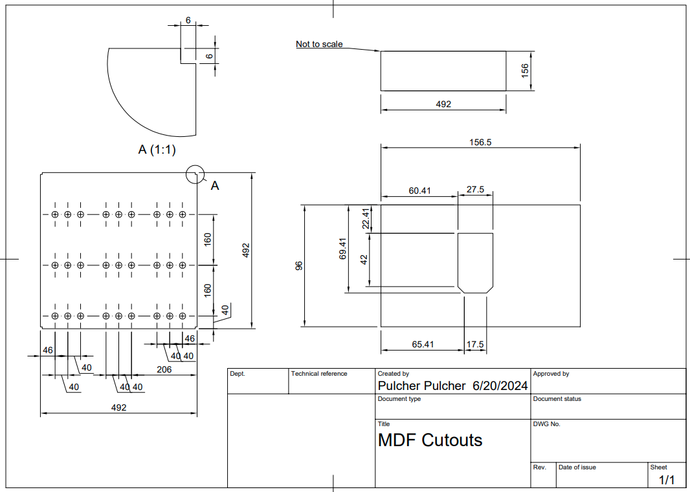
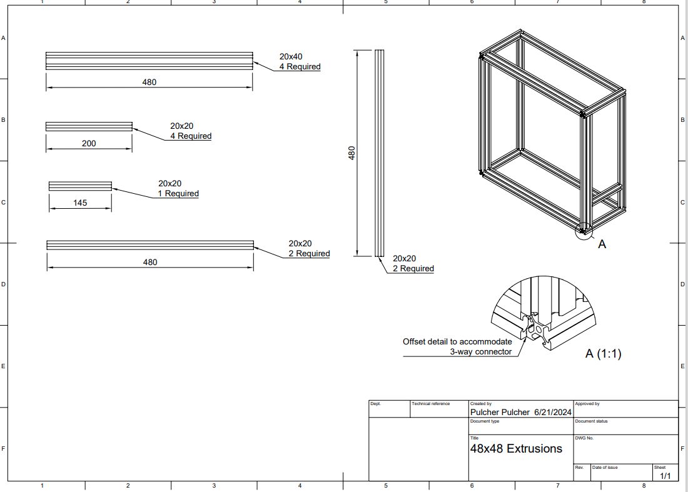

# 48x48 ie 2304 pixels of greatness

## Bill Of Material

- 9 - 16x16 RGB panels
- 1 - 5 volt 30 amp power supply
- 1/4"/6mm MDF
- 20x40 extrusions
- 20x20 extrusions

## Purpose

Cuz I think it is way cool!

## Needed parts

_all dimensions in millimeters_
[Panel Dimensions](48x48_panels.pdf)

[Extrusion Dimensions](48x48_extrusions.pdf)

## Build Steps

## Accreditation

- [BOOMY Tech](https://youtu.be/e-veSULytC4)
